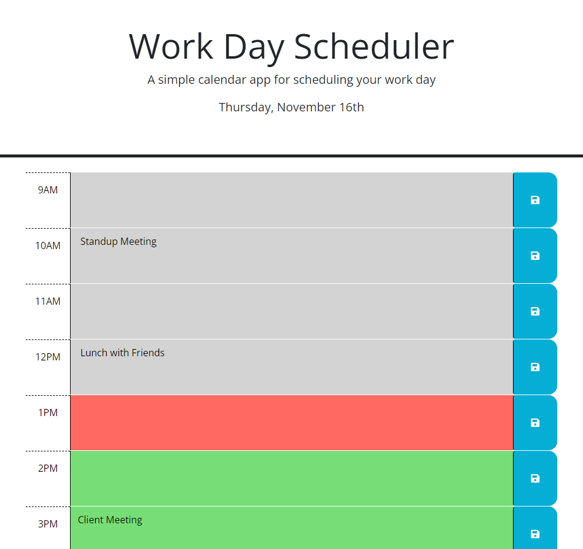

# Work Day Scheduler

## Description

This project is a webpage containing an online day planner. It can be used to record and store recurring daily tasks or events over the hours of 9am-5pm.

## Installation

The webpage is hosted online and can be accessed using the following link: https://christiehyde.github.io/WorkDayScheduler/

## Usage

A screenshot of the webpage is provided:

Users can select a time block and type a task or event into the text area. By clicking the corresponding Save button, the text will be saved into the page's local storage and will be reloaded into that text area if the page is refreshed.

Additionally, the current date is displayed at the top of the page, and the event entry blocks are coloured depending on their relation to the system's current time - grey for past, green for future, and red for the present time.

## Credits
The JavaScript code and the provided webpage screenshot, were produced by Christie Hyde for this project.
All HTML and CSS source code were provided to me by the University of Western Australia Coding Boot Camp course and are not my original creations.